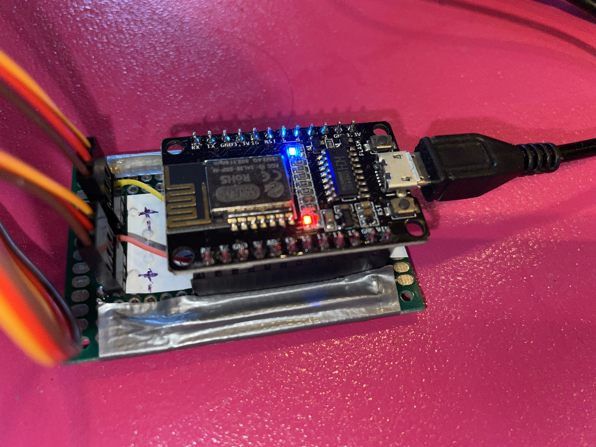

# Braha remote conrol @spreehalle

# how it works

the `ESP-Mx DevBoard` acts as a stand-alone webserver that connects to the local network (SSID and key must be provided).

it listens to 5 urls:
- `/` interface with buttons
- `/forward` move forward
- `/backward` move backward
- `/left` rotate couterclockwise (seen from above)
- `/right` rotate clockwise (seen from above)

# develop

Software to edit this repo: https://platformio.org/

## flash / upload code

1. hold FLASH button on the board
2. press RST button on the board
3. release FLASH button
4. start upload from software

# TODO / next stept

- use `millis()` instead of `delay()` to enable continuous movements. Right now, the delay() stops the program so it cannot listen to requests while the servo is active. see https://randomnerdtutorials.com/interrupts-timers-esp8266-arduino-ide-nodemcu/
- use OSC https://github.com/stahlnow/OSCLib-for-ESP8266

# resources

- https://docs.platformio.org/en/latest/boards/espressif8266/espmxdevkit.html
- https://www.mischianti.org/2021/02/17/doit-esp32-dev-kit-v1-high-resolution-pinout-and-specs/
- https://starthardware.org/servo/
